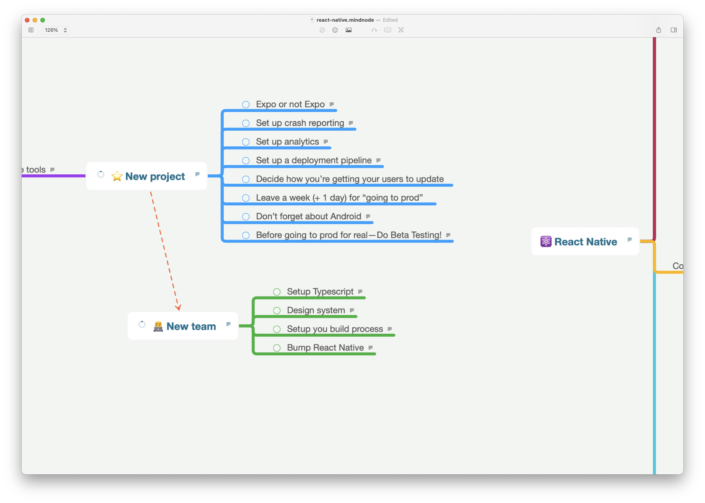

# React Native Workshop

> A series of __React Native coding challenges__ with a variety of difficulties.

Deep dive into [the workshop here](https://davidl.fr/workshop).



## Projects

1. [atls](./hackathon/atls/)
1. [newsfeed](./hackathon/newsfeed/) _with getstream API_
1. [onboarding](./hackathon/onboarding/) _with magic.link SDK_
1. [nerd-fm](./hackathon/nerd-fm/)
1. and more

## Getting Started

Run the CLI:

```console
# Vanilla React Native
npx react-native init AwesomeProject
npx ignite-cli new AwesomeApp

# Expo-powered
expo init
npx create-react-native-app
npx ignite-cli new AwesomeApp --expo

# React Native module
npx create-react-native-library react-native-awesome-module
```

## Ressources

- [React Native Community](https://github.com/react-native-community)
- [Expo Community](https://github.com/expo-community)
- [React Native Directory](https://reactnative.directory/)

## Was this helpful?

☕️ [Leaving a small tip helps me a lot!](https://www.buymeacoffee.com/flexbox)
