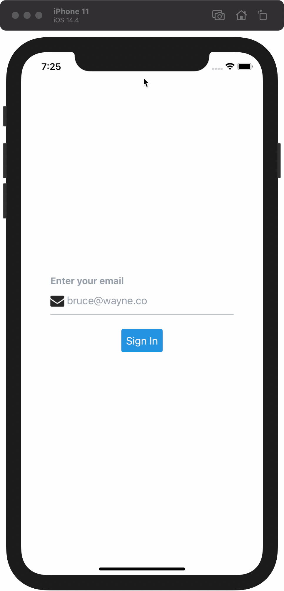

# Onboarding

> Onboarding with Magic link

## Tooling

- [Kitten UI](https://akveo.github.io/react-native-ui-kitten/)
- [Magic SDK](https://docs.magic.link/client-sdk/react-native/get-started)

## Getting Started

```console
cp .env.sample .env
yarn
yarn ios|android
```


