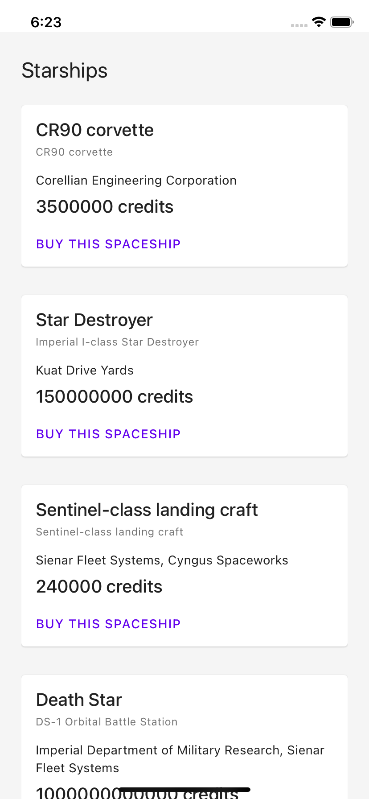

# React Native Data Management

## Learning objectives

- Create an offline experience
- Fetch and diplay datas from the Star Wars API with `useQuery`

## 🥑 Before we start the exercise

- [ ] You should have a look at [the SWAPI documentation](https://swapi.dev/documentation#starships)
- [ ] We are going to isntall AND use 2 third part-libraries `react-native-offline` and `react-query`

## 🤸‍♀️ Exercise 5.1

> Add offline feedback

🥑 [`react-native-offline` documentation](https://github.com/rgommezz/react-native-offline)

- [ ] Install the library with `yarn add react-native-offline`
- [ ] Update `App.tsx` and import `StarshipScreen`
- [ ] Go to `src/exercice/05/AppShell.tsx` and add `import { NetworkProvider } from 'react-native-offline';`
- [ ] Import a component `<Offline />`
- [ ] Go to `src/exercice/05/Offline.tsx` Add a message when the user is not connected

## 🤸‍♀️ Exercise 5.2

> Fetch data over the network

- 🥑 [`QueryClientProvider` documentation](https://react-query.tanstack.com/reference/QueryClientProvider#_top)
- 🥑 [`react-query` documentation](https://react-query.tanstack.com/docs/guides/queries)
- 🥑 [Star Wars API documentation](https://swapi.dev/documentation#starships)

- [ ] Install the library with `yarn add react-query`
- [ ] Add a `QueryClientProvider` and wrap the application. This time you need to wrap everything from `App.tsx`
- [ ] Use `useQuery` hooks with `fetchAsync('https://swapi.dev/api/starships/')` to query datas (import it from `/src/fetch.ts`), don't forget to check `react-query` documentation
- [ ] Use the `StarShipCard` to display the datas

## Bonus

- [ ] Add a modal to display all the datas about the spaceship https://callstack.github.io/react-native-paper/modal.html

## 🏅 Elaboration and Feedback

After one exercice, if you want to remember what you've just learned, then 
<a rel="noopener noreferrer" target="_blank" href="https://airtable.com/shrBuZqOJL5UeLLF1?prefill_Name=React+Native+Data+Management&prefill_Exercice=5">
  fill out the elaboration and feedback form.
</a>

